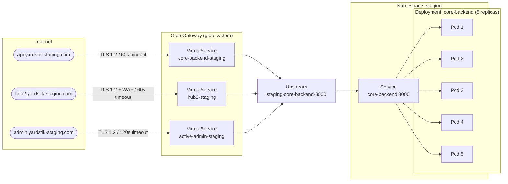
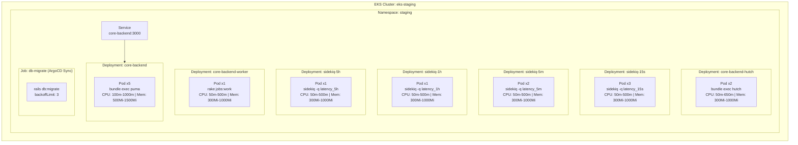
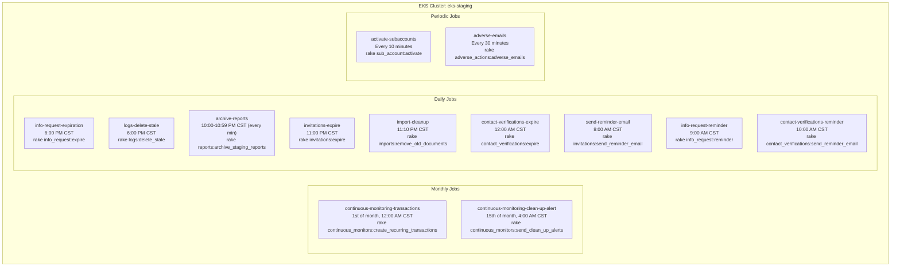

# core.backend - Staging Deployment

> **Namespace:** `staging` | **Cluster:** `eks-staging` | **Image:** `v1.935.2` | **Service Account:** `yardstik-staging`

---

## 1. Network

All virtual services use **Gloo Gateway** with TLS v1.2 minimum and the `star.yardstik-staging.com` certificate. HTTP requests are redirected to HTTPS on all domains.

### Virtual Service Summary

| Domain | Path | Match Type | Upstream | Timeout | Retries | Per-Try Timeout | Retry On | Notable Options |
|--------|------|------------|----------|---------|---------|-----------------|----------|-----------------|
| `api.yardstik-staging.com` | `/twilio/voice/reply` | Prefix | _(direct response 200)_ | - | - | - | - | Returns XML voice response |
| `api.yardstik-staging.com` | `/vite` | Prefix | `staging-core-backend-3000` | - | - | - | - | `Cache-Control: max-age=31536000, immutable` |
| `api.yardstik-staging.com` | `/bullhorn/{hash}/tab` | Regex | `staging-core-backend-3000` | - | - | - | - | CSP with `frame-ancestors bullhornstaffing.com` |
| `api.yardstik-staging.com` | `/` | Prefix | `staging-core-backend-3000` | 60s | 3 | 10s | connect-failure, refused-stream, reset | HSTS, removes `server` header |
| `hub2.yardstik-staging.com` | `/` | Prefix | `staging-core-backend-3000` | 60s | 3 | 10s | cancelled, reset, unavailable, gateway-error, connect-failure, refused-stream, retriable-status-codes | CORS enabled, WAF (Log4j CVE, CloudFront header checks), CSP |
| `admin.yardstik-staging.com` | `/` | Prefix | `staging-core-backend-3000` | 120s | 2 | 60s | connect-failure, refused-stream, reset | CSP, X-Frame-Options SAMEORIGIN |

### Response Headers Applied

| Domain | Cache-Control | HSTS | CSP | X-Frame-Options | CORS | WAF |
|--------|--------------|------|-----|-----------------|------|-----|
| `api.yardstik-staging.com` | no-cache, no-store | 63072000s | - | - | Methods only | - |
| `hub2.yardstik-staging.com` | no-cache, no-store | 63072000s | Yes (self, https, wss, data, blob) | SAMEORIGIN | Full (credentials, origins, regex) | ModSecurity CRS + custom rules |
| `admin.yardstik-staging.com` | no-cache, no-store | 63072000s | Yes (self, https, wss, data) | SAMEORIGIN | Methods + Origin | - |

### Network Diagram

---

## 2. Deployments and Pods

All deployments run as non-root (`uid: 10001`), use the same container image, and include an init container that checks for pending migrations before starting.

### Deployment Summary

| Deployment | Replicas | Command | CPU (req/lim) | Memory (req/lim) | Readiness Probe | Liveness Probe | Init Container |
|------------|----------|---------|---------------|-------------------|-----------------|----------------|----------------|
| `core-backend` | 5 | `bundle exec puma -C config/puma.rb` | 100m / 1000m | 500Mi / 1500Mi | HTTP `/health:3000` (30s interval, 30s delay) | HTTP `/health:3000` (30s interval, 30s delay) | `rake db:abort_if_pending_migrations` |
| `core-backend-hutch` | 2 | `bundle exec hutch` | 50m / 650m | 300Mi / 1000Mi | - | - | `rake db:abort_if_pending_migrations` |
| `core-backend-sidekiq-15s` | 3 | `bundle exec sidekiq -q latency_15s` | 50m / 500m | 300Mi / 1000Mi | - | HTTP `:7433/` (30s interval, 30s delay) | `rake db:abort_if_pending_migrations` |
| `core-backend-sidekiq-5m` | 2 | `bundle exec sidekiq -q latency_5m` | 50m / 500m | 300Mi / 1000Mi | - | HTTP `:7433/` (30s interval, 30s delay) | `rake db:abort_if_pending_migrations` |
| `core-backend-sidekiq-1h` | 1 | `bundle exec sidekiq -q latency_1h` | 50m / 500m | 300Mi / 1000Mi | - | HTTP `:7433/` (30s interval, 30s delay) | `rake db:abort_if_pending_migrations` |
| `core-backend-sidekiq-5h` | 1 | `bundle exec sidekiq -q latency_5h` | 50m / 500m | 300Mi / 1000Mi | - | HTTP `:7433/` (30s interval, 30s delay) | `rake db:abort_if_pending_migrations` |
| `core-backend-worker` | 1 | `rake jobs:work` | 50m / 500m | 300Mi / 1000Mi | - | - | `rake db:abort_if_pending_migrations` |

### Ephemeral Job

| Job | Command | Trigger | Backoff Limit | TTL After Finished |
|-----|---------|---------|---------------|--------------------|
| `db-migrate` | `rails db:migrate` | ArgoCD Sync Hook | 3 | 3600s |

### Deployment Diagram

---

## 3. CronJobs

All cron schedules are defined in **UTC**. Human-readable times shown in **US Central Time (CST / UTC-6)**.

### CronJob Summary

| CronJob Name | Schedule (UTC) | Schedule (CST) | Command |
|--------------|----------------|----------------|---------|
| `core-backend-activate-subaccounts` | `*/10 * * * *` | Every 10 minutes | `rake sub_account:activate` |
| `core-backend-adverse-emails` | `*/30 * * * *` | Every 30 minutes | `rake adverse_actions:adverse_emails` |
| `core-backend-archive-reports` | `* 4 * * *` | Every minute, 10:00-10:59 PM CST | `rake reports:archive_staging_reports` |
| `core-backend-contact-verifications-expire` | `0 6 * * *` | 12:00 AM (midnight) CST daily | `rake contact_verifications:expire` |
| `core-backend-contact-verifications-reminder` | `0 16 * * *` | 10:00 AM CST daily | `rake contact_verifications:send_reminder_email` |
| `core-backend-continuous-monitoring-clean-up-alert` | `0 10 15 * *` | 4:00 AM CST, 15th of each month | `rake continuous_monitors:send_clean_up_alerts` |
| `core-backend-continuous-monitoring-transactions` | `0 6 1 * *` | 12:00 AM (midnight) CST, 1st of each month | `rake continuous_monitors:create_recurring_transactions` |
| `core-backend-import-cleanup` | `10 5 * * *` | 11:10 PM CST daily | `rake imports:remove_old_documents` |
| `info-request-expiration` | `0 0 * * *` | 6:00 PM CST daily | `rake info_request:expire` |
| `core-backend-invitations-expire` | `0 5 * * *` | 11:00 PM CST daily | `rake invitations:expire` |
| `core-backend-logs-delete-stale` | `0 0 * * *` | 6:00 PM CST daily | `rake logs:delete_stale` |
| `info-request-reminder` | `0 15 * * *` | 9:00 AM CST daily | `rake info_request:reminder` |
| `core-backend-send-reminder-email` | `0 14 * * *` | 8:00 AM CST daily | `rake invitations:send_reminder_email` |

> All CronJobs use `concurrencyPolicy: Forbid`, `successfulJobsHistoryLimit: 1`, `failedJobsHistoryLimit: 2`, and `restartPolicy: Never`.

### CronJob Diagram

