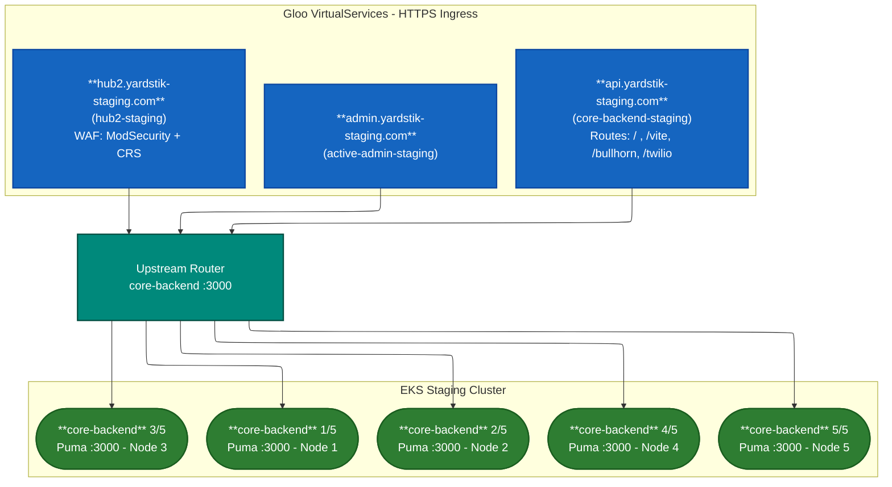

# Core Backend - EKS Staging Deployment Diagram

> **Image:** `core.backend:v1.903.0` | **Namespace:** `staging` | **7 Deployments / 15 Pods**

---

## Network Flow

---

## Deployments & Pod Distribution

```mermaid
---
config:
  theme: default
  themeVariables:
    fontSize: 18px
  flowchart:
    nodeSpacing: 60
    rankSpacing: 60
    padding: 40
    defaultRenderer: elk
---
graph TD
    subgraph CLUSTER["EKS Staging Cluster - Namespace: staging"]

        subgraph NODE1["Puma"]
            N1_APP(["**core-backend** 1/5<br/>Puma :3000"])
            N1_APP(["**core-backend** 2/5<br/>Puma :3000"])
            N1_APP(["**core-backend** 3/5<br/>Puma :3000"])
            N1_APP(["**core-backend** 4/5<br/>Puma :3000"])
            N1_APP(["**core-backend** 5/5<br/>Puma :3000"])
        end

        subgraph NODE2["Sidekiq"]
            N2_SK15(["**sidekiq-15s** 1/3<br/>Queue: latency_15s"])
            N2_SK15(["**sidekiq-15s** 2/3<br/>Queue: latency_15s"])
            N2_SK15(["**sidekiq-15s** 3/3<br/>Queue: latency_15s"])
            N2_SK5M(["**sidekiq-5m** 1/2<br/>Queue: latency_5m"])
            N2_SK5M(["**sidekiq-5m** 2/2<br/>Queue: latency_5m"])
            N2_SK1H(["**sidekiq-1h** 1/1<br/>Queue: latency_1h"])
            N2_SK5H(["**sidekiq-5h** 1/1<br/>Queue: latency_5h"])
        end

        subgraph NODE3["Worker"]
            N3_WORKER(["**worker** 1/1<br/>rake jobs:work"])
        end

        subgraph NODE4["Hutch"]
            N4_HUTCH(["**hutch** 1/2<br/>RabbitMQ Consumer"])
            N4_HUTCH(["**hutch** 2/2<br/>RabbitMQ Consumer"])
        end

        MIGRATE["**Job: db-migrate**<br/>ArgoCD Sync Hook<br/>rails db:migrate<br/>backoffLimit: 3"]
    end

    classDef appPod fill:#2e7d32,stroke:#1b5e20,color:#fff,stroke-width:2px
    classDef sidekiqPod fill:#6a1b9a,stroke:#4a148c,color:#fff,stroke-width:2px
    classDef hutchPod fill:#e65100,stroke:#bf360c,color:#fff,stroke-width:2px
    classDef workerPod fill:#ad1457,stroke:#880e4f,color:#fff,stroke-width:2px
    classDef migration fill:#546e7a,stroke:#37474f,color:#fff,stroke-width:2px

    class N1_APP,N2_APP,N3_APP,N4_APP,N5_APP appPod
    class N1_SK15,N2_SK15,N3_SK15,N2_SK5M,N4_SK5M,N4_SK1H,N5_SK5H sidekiqPod
    class N1_HUTCH,N5_HUTCH hutchPod
    class N3_WORKER workerPod
    class MIGRATE migration
```

### Deployment Summary

| Deployment | Replicas | Command | Resources |
|---|---|---|---|
| **core-backend** | 5 | `puma -C config/puma.rb` | CPU: 100m-1000m, Mem: 500Mi-1500Mi |
| **core-backend-hutch** | 2 | `hutch` (RabbitMQ) | CPU: 50m-650m, Mem: 300Mi-1000Mi |
| **sidekiq-15s** | 3 | `sidekiq -q latency_15s` | CPU: 50m-500m, Mem: 300Mi-1000Mi |
| **sidekiq-5m** | 2 | `sidekiq -q latency_5m` | CPU: 50m-500m, Mem: 300Mi-1000Mi |
| **sidekiq-1h** | 1 | `sidekiq -q latency_1h` | CPU: 50m-500m, Mem: 300Mi-1000Mi |
| **sidekiq-5h** | 1 | `sidekiq -q latency_5h` | CPU: 50m-500m, Mem: 300Mi-1000Mi |
| **worker** | 1 | `rake jobs:work` | CPU: 50m-500m, Mem: 300Mi-1000Mi |
| **Total** | **15 pods** | | |

All deployments use `initContainer` to run `rake db:abort_if_pending_migrations` before starting.

---

## CronJobs

```mermaid
---
config:
  theme: default
  themeVariables:
    fontSize: 18px
  flowchart:
    nodeSpacing: 60
    rankSpacing: 60
    padding: 40
    defaultRenderer: elk
---
graph TD
    subgraph CRONJOBS["CronJobs & Pods - concurrencyPolicy: Forbid - restartPolicy: Never"]

        subgraph HIGH_FREQ["Every 10-30 min"]
            CJ1{{"**activate-subaccounts**<br/>*/10 * * * *<br/>sub_account:activate"}}
            CJ2{{"**adverse-emails**<br/>*/30 * * * *<br/>adverse_actions:adverse_emails"}}
        end

        subgraph DAILY["Daily Schedule"]
            CJ3{{"**archive-reports**<br/>4:00 AM"}}
            CJ4{{"**contact-verify-expire**<br/>6:00 AM"}}
            CJ5{{"**contact-verify-reminder**<br/>4:00 PM"}}
            CJ6{{"**import-cleanup**<br/>5:10 AM"}}
            CJ7{{"**info-request-expire**<br/>Midnight"}}
            CJ8{{"**invitations-expire**<br/>5:00 AM"}}
            CJ9{{"**logs-delete-stale**<br/>Midnight"}}
            CJ10{{"**info-request-reminder**<br/>3:00 PM"}}
            CJ11{{"**send-reminder-email**<br/>2:00 PM"}}
        end

        subgraph MONTHLY["Monthly Schedule"]
            CJ12{{"**cm-transactions**<br/>1st @ 6:00 AM"}}
            CJ13{{"**cm-cleanup-alert**<br/>15th @ 10:00 AM"}}
        end
    end

    classDef cronJob fill:#f9a825,stroke:#f57f17,color:#000,stroke-width:2px
    class CJ1,CJ2,CJ3,CJ4,CJ5,CJ6,CJ7,CJ8,CJ9,CJ10,CJ11,CJ12,CJ13 cronJob
```

### CronJob Schedule

| CronJob | Schedule | Rake Task |
|---|---|---|
| activate-subaccounts | `*/10 * * * *` | `sub_account:activate` |
| adverse-emails | `*/30 * * * *` | `adverse_actions:adverse_emails` |
| archive-reports | `0 4 * * *` | `reports:archive_staging_reports` |
| contact-verify-expire | `0 6 * * *` | `contact_verifications:expire` |
| contact-verify-reminder | `0 16 * * *` | `contact_verifications:send_reminder_email` |
| import-cleanup | `10 5 * * *` | `imports:remove_old_documents` |
| info-request-expire | `0 0 * * *` | `info_request:expire` |
| invitations-expire | `0 5 * * *` | `invitations:expire` |
| logs-delete-stale | `0 0 * * *` | `logs:delete_stale` |
| info-request-reminder | `0 15 * * *` | `info_request:reminder` |
| send-reminder-email | `0 14 * * *` | `invitations:send_reminder_email` |
| cm-transactions | `0 6 1 * *` | `continuous_monitors:create_recurring_transactions` |
| cm-cleanup-alert | `0 10 15 * *` | `continuous_monitors:send_clean_up_alerts` |
