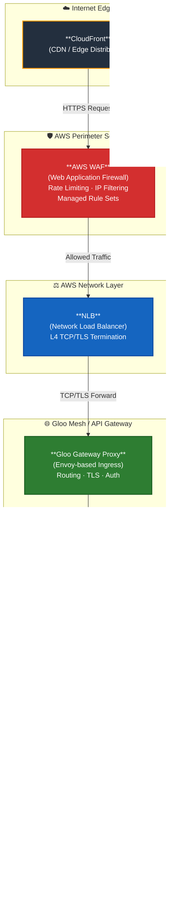

# Network Diagram - Generic

```mermaid
---
config:
  theme: default
  flowchart:
    nodeSpacing: 60
    rankSpacing: 80
    padding: 30
---
graph TD
    subgraph Internet["☁️ Internet Edge"]
        CF["**CloudFront**<br/>(CDN / Edge Distribution)"]
    end

    subgraph AWSEdge["🛡️ AWS Perimeter Security"]
        WAF["**AWS WAF**<br/>(Web Application Firewall)<br/>Rate Limiting · IP Filtering<br/>Managed Rule Sets"]
    end

    subgraph AWSNetwork["⚖️ AWS Network Layer"]
        NLB["**NLB**<br/>(Network Load Balancer)<br/>L4 TCP/TLS Termination"]
    end

    subgraph GlooLayer["🌐 Gloo Mesh / API Gateway"]
        GProxy["**Gloo Gateway Proxy**<br/>(Envoy-based Ingress)<br/>Routing · TLS · Auth"]
        GWAF["**Gloo WAF**<br/>(ModSecurity / OWASP)<br/>L7 Inspection · CRS Rules"]
    end

    subgraph K8sSecurity["🔒 Kubernetes Network Security"]
        SG["**Security Group**<br/>(ENI-level Firewall)<br/>Port & Protocol Filtering"]
    end

    subgraph K8sWorkload["📦 Kubernetes Workload"]
        POD["**Kubernetes Pod**<br/>(Application Container)"]
    end

    CF -->|"HTTPS Request"| WAF
    WAF -->|"Allowed Traffic"| NLB
    NLB -->|"TCP/TLS Forward"| GProxy
    GProxy -->|"L7 Routing"| GWAF
    GWAF -->|"Inspected Traffic"| SG
    SG -->|"Permitted Ingress"| POD

    classDef internet fill:#232f3e,stroke:#ff9900,color:#fff,stroke-width:2px
    classDef security fill:#d32f2f,stroke:#b71c1c,color:#fff,stroke-width:2px
    classDef network fill:#1565c0,stroke:#0d47a1,color:#fff,stroke-width:2px
    classDef gateway fill:#2e7d32,stroke:#1b5e20,color:#fff,stroke-width:2px
    classDef k8s fill:#6a1b9a,stroke:#4a148c,color:#fff,stroke-width:2px

    class CF internet
    class WAF security
    class NLB network
    class GProxy,GWAF gateway
    class SG security
    class POD k8s
```
